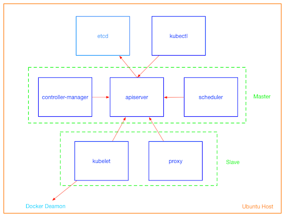
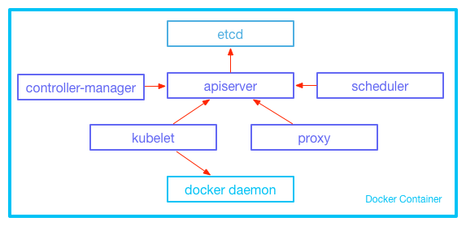

title: 如何运行多进程Docker容器？

date: 2016-01-09 21:00:00

tags: [Docker, Kubernetes]

---

**摘要:** 本文介绍了两种在Docker容器中运行多个进程的方法: **shell脚本**和**supervisor**。

**GitHub地址:**
- [kiwenlau/kubernetes-shell](https://github.com/kiwenlau/kubernetes-shell)
- [kiwenlau/kubernetes-supervisor](https://github.com/kiwenlau/kubernetes-supervisor)

<!-- more -->

- 作者: [KiwenLau](http://kiwenlau.com/)
- 日期: [2016-01-09](http://kiwenlau.com/2016/01/09/160109-multiple-processes--docker-container/)

##简介

一般来说，Docker容器比较适合运行单个进程。例如，项目"**使用多个Docker容器运行Kubernetes**"，Kubernetes的各个组件分别运行在各个容器之中，每个容器只运行单个进程。

然而，很多时候我们需要在Docker容器中运行多个进程。例如，项目"**使用单个Docker容器运行Kubernetes**"，kubernetes的各个组件均运行在同一个容器中，该容器中运行了多个进程。那么，**如何运行多进程Docker容器？**

一种方法是使用**Shell脚本**，另一种方法是使用进程管理工具[Supervisor](http://supervisord.org/)。[kiwenlau/kubernetes-shell](https://github.com/kiwenlau/kubernetes-shell)和[kiwenlau/kubernetes-supervisor](https://github.com/kiwenlau/kubernetes-supervisor)分别采用了这两种方法，用于启动多个进程来运行Kubernetes的各个组件，从而实现"**使用单个Docker容器运行Kubernetes**"。下面我将分别介绍两种不同方法。

##使用Shell脚本运行多进程Docker容器

这个方法大家应该会比较熟悉，使用Shell脚本依次启动Kubernetes的各个组件即可。以下为**start-kubernetes.sh**

```
#!/bin/bash

# start docker daemon
docker daemon > /var/log/docker.log 2>&1 &

# start etcd
etcd --data-dir=/var/etcd/data > /var/log/etcd.log 2>&1 &

# wait for ectd to setup
sleep 5

# start apiserver
kube-apiserver --service-cluster-ip-range=10.0.0.1/24 --insecure-bind-address=0.0.0.0 --etcd_servers=http://127.0.0.1:4001 > /var/log/kube-apiserver.log 2>&1 &

# wait for apiserver to setup
sleep 5

# start controller manager, sheduler, kubelet and proxy
kube-controller-manager --master=http://0.0.0.0:8080 > /var/log/kube-controller-manager.log 2>&1 &
kube-scheduler --master=http://0.0.0.0:8080 > /var/log/kube-scheduler.log 2>&1 &
kubelet --api_servers=http://0.0.0.0:8080 --address=0.0.0.0 --cluster_dns=10.0.0.10 --cluster_domain="kubernetes.local" --pod-infra-container-image="kiwenlau/pause:0.8.0"  > /var/log/kubelet.log 2>&1 &
kube-proxy --master=http://0.0.0.0:8080 > /var/log/kube-proxy.log 2>&1 &

# just keep this script running
while [[ true ]]; do
	sleep 1
done
```

然后在Dockerfile中，将**start-kubernetes.sh**指定为Docker容器默认执行的命令即可:

```
CMD ["start-kubernetes.sh"]
```

**需要注意**的一点在于，**start-kubernetes.sh**脚本将作为Docker容器的1号进程运行，必须始终保持运行。因为**Docker容器仅在1号进程运行时保持运行**，换言之，Docker容器将在1号进程退出后**Exited**。由于Kubernetes的各个组件都以后台进程方式执行，我在脚本末尾添加了死循环，以保持**start-kubernetes.sh**脚本始终处于运行状态。

```
# just keep this script running
while [[ true ]]; do
	sleep 1
done
```

##使用supervisor运行多进程Docker容器

[Supervisor](http://supervisord.org/)是进程管理工具。这时，需要编写supervisor的配置文件**kubernetes.conf**:

```
[supervisord]
nodaemon=true

[program:etcd]
command=etcd --data-dir=/var/etcd/data
autorestart=true
stdout_logfile=/var/log/etcd.stdout.log
stderr_logfile=/var/log/etcd.stderr.log

[program:kube-apiserver]
command=kube-apiserver --service-cluster-ip-range=10.0.0.1/24 --insecure-bind-address=0.0.0.0 --etcd_servers=http://127.0.0.1:4001
autorestart=true
stdout_logfile=/var/log/kube-apiserver.stdout.log
stderr_logfile=/var/log/kube-apiserver.stderr.log

[program:kube-controller-manager]
command=kube-controller-manager --master=http://0.0.0.0:8080
autorestart=true
stdout_logfile=/var/log/controller-manager.stdout.log
stderr_logfile=/var/log/controller-manager.stderr.log

[program:kube-scheduler]
command=kube-scheduler --master=http://0.0.0.0:8080
autorestart=true
stdout_logfile=/var/log/kube-scheduler.stdout.log
stderr_logfile=/var/log/kube-scheduler.stderr.log

[program:kubelet]
command=kubelet --api_servers=http://0.0.0.0:8080 --address=0.0.0.0 --cluster_dns=10.0.0.10 --cluster_domain="kubernetes.local" --pod-infra-container-image="kiwenlau/pause:0.8.0"
autorestart=true
stdout_logfile=/var/log/kubelet.stdout.log
stderr_logfile=/var/log/kubelet.stderr.log

[program:kube-proxy]
command=kube-proxy --master=http://0.0.0.0:8080
autorestart=true
stdout_logfile=/var/log/kube-proxy.stdout.log
stderr_logfile=/var/log/kube-proxy.stderr.log

[program:docker]
command=docker daemon
autorestart=true
stdout_logfile=/var/log/docker.stdout.log
stderr_logfile=/var/log/docker.stderr.log
```

可知，将Kubernetes的各个组件的启动命令设为command即可。autorestart参数设为true，意味着supervisor将负责重启意外退出的组件。stdout_logfile和stderr_logfile参数则可以用于设置命令的标准输出文件和标准错误输出文件。

然后在Dockerfile中，将**supervisord**指定为Docker容器默认执行的命令即可:

```
CMD ["supervisord", "-c", "/etc/supervisor/conf.d/kubernetes.conf"]
```

此时, supervisord是Docker容器中的1号进程，也需要始终保持运行状态。nodaemon设为true时，表示supervisor保持前台运行而非在后台运行。若supervisor在后台运行，则Docker容器也会在执行supervisord命令后立即Exited.

```
[supervisord]
nodaemon=true
```


##总结

使用Shell脚本运行多进程Docker容器，优势是大家比较熟悉。由于需要保持Docker容器的1号进程始终运行，这一点比较容易出错。若要实现进程意外退出后自动重启的话，使用shell脚本比较麻烦。

使用supervisor运行多进程Docker容器，非常方便。另外，保持1号进程保持运行，以及进程意外退出后自动重启，实现起来都很简单。


##使用多个Docker容器运行Kubernetes

**GitHub地址**

- [kiwenlau/single-kubernetes-docker](https://github.com/kiwenlau/single-kubernetes-docker)

下图显示了我在Ubuntu主机上运行单机版Kubernetes的架构。可知，我一共运行了7个容器，分别运行Kubernetes的各个组件。



##使用单个Docker容器运行Kubernetes

**GitHub地址:**

- [kiwenlau/kubernetes-shell](https://github.com/kiwenlau/kubernetes-shell)
- [kiwenlau/kubernetes-supervisor](https://github.com/kiwenlau/kubernetes-supervisor)

该项目中，我将kubernetes的所有组件：etcd, controller manager, apiserver, scheduler, kubelet, proxy以及docker daemon均运行在同一个Docker容器之中。

容器启动时，各个组件由shell脚本或者supervisor启动。



##参考
1. [Using Supervisor with Docker](https://docs.docker.com/engine/articles/using_supervisord/)
2. [How To Install and Manage Supervisor on Ubuntu and Debian VPS](https://www.digitalocean.com/community/tutorials/how-to-install-and-manage-supervisor-on-ubuntu-and-debian-vps)
3. [基于Docker搭建单机版Kuberntes](http://kiwenlau.com/2015/11/28/151128-single-kubernetes-docker/)
4. [kiwenlau/single-kubernetes-docker](https://github.com/kiwenlau/single-kubernetes-docker)

<br /> 

***
**版权声明**
转载时请注明作者[KiwenLau](http://kiwenlau.com/)以及本文地址：
[http://kiwenlau.com/2016/01/09/160109-multiple-processes--docker-container/](http://kiwenlau.com/2016/01/09/160109-multiple-processes--docker-container/)
***


